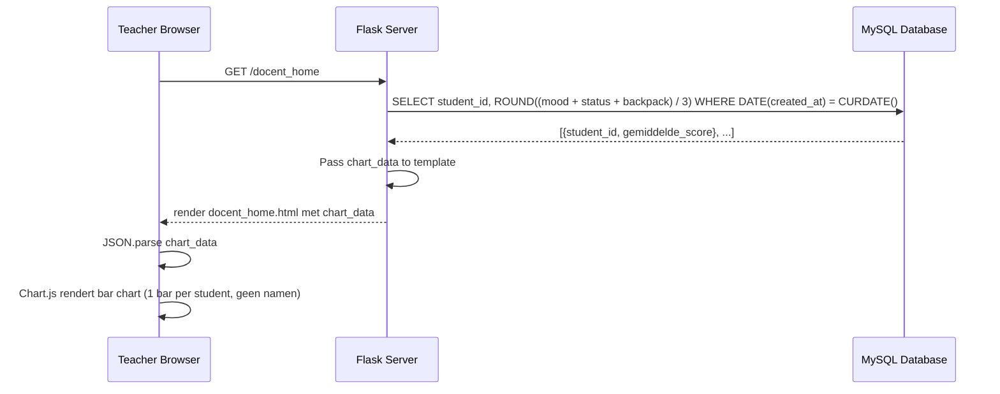

```mermaid
sequenceDiagram
    participant T as Teacher Browser
    participant F as Flask Server
    participant DB as MySQL Database

    T->>F: GET /docent_home
    F->>DB: SELECT student_id, ROUND((mood + status + backpack) / 3) WHERE DATE(created_at) = CURDATE()
    DB-->>F: [{student_id, gemiddelde_score}, ...]
    F->>F: Pass chart_data to template
    F-->>T: render docent_home.html met chart_data
    T->>T: JSON.parse chart_data
    T->>T: Chart.js rendert bar chart (1 bar per student, geen namen)
```

