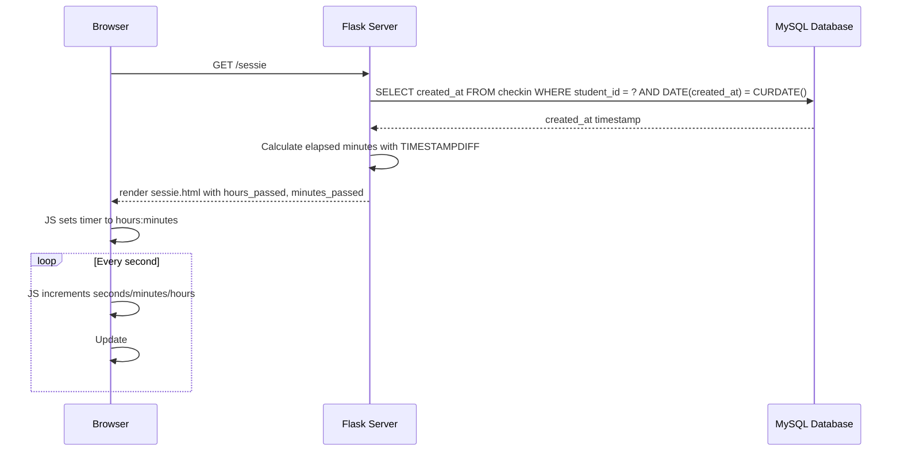

```mermaid
sequenceDiagram
    participant B as Browser
    participant F as Flask Server
    participant DB as MySQL Database

    B->>F: GET /sessie
    F->>DB: SELECT created_at FROM checkin WHERE student_id = ? AND DATE(created_at) = CURDATE()
    DB-->>F: created_at timestamp
    F->>F: Calculate elapsed minutes with TIMESTAMPDIFF
    F-->>B: render sessie.html with hours_passed, minutes_passed
    B->>B: JS sets timer to hours:minutes
    loop Every second
        B->>B: JS increments seconds/minutes/hours
        B->>B: Update #timer display
    end
```